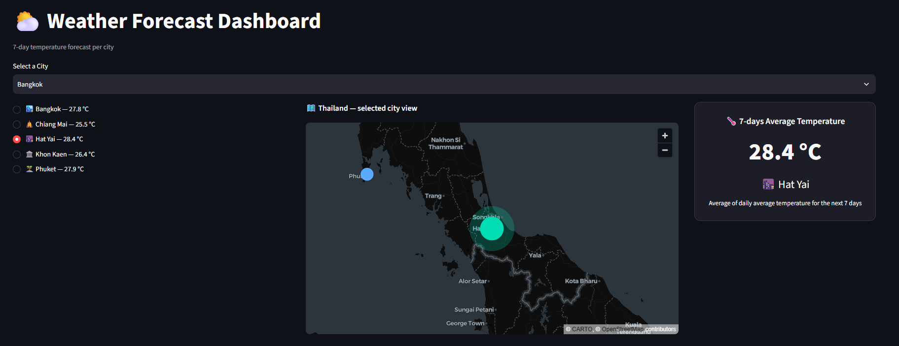
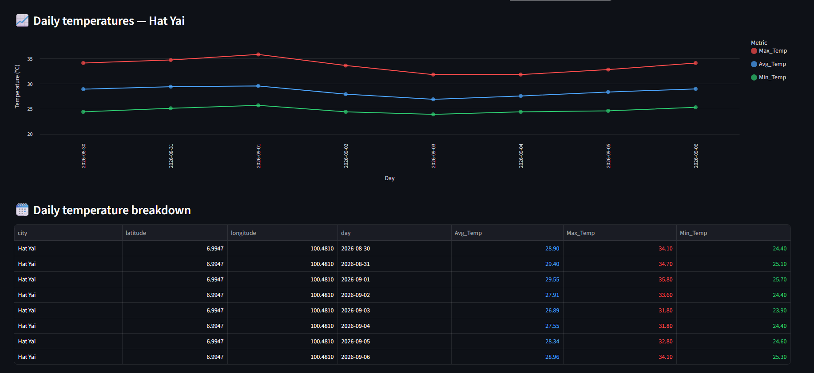
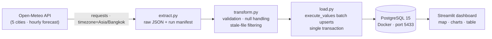
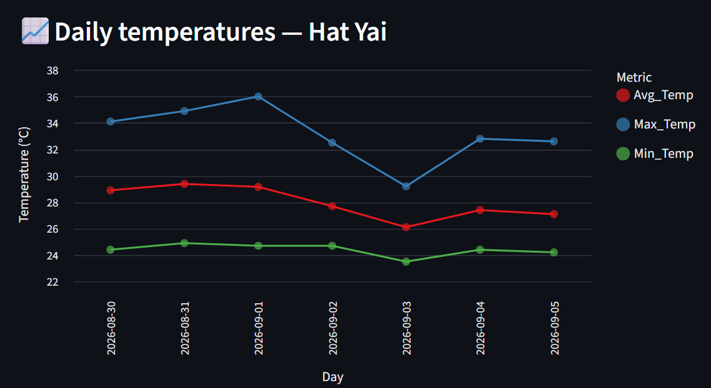

# ⛅ Weather Data Pipeline


An end-to-end **data pipeline** that extracts 7-day hourly weather forecasts for 5 major Thai cities (Bangkok, Chiang Mai, Phuket, Khon Kaen, Hat Yai) from the [Open-Meteo API](https://open-meteo.com/), validates and transforms them, loads them into **PostgreSQL** with idempotent batched upserts, and serves them through an interactive **Streamlit** dashboard with a clickable Thailand map.

The pipeline is **fully idempotent** — it can be re-run any number of times without duplicating or corrupting data — and is **failure-tolerant by design**: failed extractions, stale files, null values, and mid-load crashes can never leave partial or outdated data behind.

## Dashboard Preview


<p align="center">
  <table>
    <tr>
      <td width="50%" valign="top"></td>
      <td width="50%" valign="top"></td>
    </tr>
  </table>
</p>

## Overview

The pipeline answers a simple question — *how will temperature and rain chance evolve over the next 7 days?* — using production-style data engineering practices:

1. **Extract** (`script/extract.py`) — calls the Open-Meteo Forecast API for 5 Thai cities with `timezone=Asia/Bangkok`, saves raw JSON per city, and writes a per-run **manifest** recording which cities succeeded or failed.
2. **Transform** (`script/transform.py`) — maps payloads into two entities (cities / forecasts), validates column lengths, counts and **drops null weather values** to protect the `NOT NULL` constraints, and uses the manifest to **skip stale raw files** left behind by failed runs.
3. **Load** (`script/load.py`) — opens a single transaction and **batch-upserts** rows with `execute_values` + `ON CONFLICT DO UPDATE`; any failure rolls the whole transaction back, so partial data can never be saved.
4. **Serve** (`app/main.py`) — queries PostgreSQL through Streamlit's SQL connection (10-minute cache) and renders the dashboard.

## Architecture



## Tech Stack

| Layer | Tools |
|---|---|
| Language | Python 3.10+ |
| Ingestion | `requests` (Open-Meteo Forecast API) |
| Storage | PostgreSQL 15, Docker Compose, Adminer (DB UI) |
| Database access | `psycopg2` (`execute_values` batched upserts) |
| Orchestration | `run_pipeline.py` — fail-fast stage chaining |
| Visualization | Streamlit, Altair, pandas |
| Ops | Structured file logging (`logs/pipeline.log`), `python-dotenv` secrets |

## Engineering Highlights

- **Idempotency by design** — every insert is an upsert (`ON CONFLICT DO UPDATE`) keyed on the table's primary key, so re-runs update existing rows instead of duplicating them.
- **Failure atomicity via run manifest** — `extract.py` writes a manifest of the cities fetched *in this run*; `transform.py` refuses to process raw files not in the manifest, so stale data from a previously failed city can never reach the database.
- **Transactional load** — all writes happen in one transaction; on any error the connection rolls back and the log records *"no partial data was saved"*.
- **Batched writes** — `psycopg2.extras.execute_values` pushes all rows in bulk instead of row-by-row round trips.
- **Data-quality gate in transform** — column-length mismatches and null counts are detected and logged per city; rows containing null temperature/precipitation are dropped before load.
- **Fail-fast orchestration** — `run_pipeline.py` runs each stage as its own process and aborts immediately if any stage exits non-zero, so a broken run never reaches the load stage with bad data.
- **Structured logging** — every stage logs timings, row counts, and warnings to `logs/pipeline.log`.
- **Secrets never committed** — `.env` and `secrets.toml` are gitignored; only `.example` templates are in the repo.

## Dashboard Features

- 🗺️ Interactive Thailand map that zooms to the selected city
- 🔗 City list and dropdown kept in sync via Streamlit `session_state`
- 🌡️ 7-day average temperature card per city
- 📈 Daily max / avg / min line chart (Altair) with tooltips and zoom
- 🗓️ Color-coded daily temperature breakdown table
- ⚡ 10-minute query cache (`st.connection` with `ttl="10m"`)
- 🕒 All timestamps normalized to Thai local time (`Asia/Bangkok`)

## Project Structure

```
weather-data-pipeline/
├── app/
│   ├── main.py                       # Streamlit dashboard
│   ├── components/map.py             # Thailand map component
│   └── .streamlit/secrets.toml.example
├── script/
│   ├── extract.py                    # fetch raw JSON + write run manifest
│   ├── transform.py                  # validate, clean, filter stale files
│   ├── load.py                       # transactional batched upserts
│   ├── run_pipeline.py               # fail-fast orchestrator
│   └── logger.py                     # shared logging helper
├── sql/
│   ├── schema.sql                    # DDL: city + forecast tables
│   ├── queries.sql                   # analytics queries (CTEs, window functions)
│   └── query_results/                # saved outputs (q1–q4)
├── data/
│   ├── raw_data/                     # per-city raw API payloads
│   └── cleaned_data/                 # transform output
├── img/                              # dashboard screenshots
├── logs/pipeline.log                 # generated at runtime
├── docker-compose.yml
├── requirements.txt
└── README.md
```

## Setup & Running the Pipeline

### Prerequisites
- Python 3.10+
- Docker (for the PostgreSQL database)

### 1) Start the PostgreSQL database
```bash
docker-compose up -d db
```
The database listens on port **5433** (mapped from 5432) with persistent storage in a docker volume. Adminer (DB UI) is also available at http://localhost:8080 if you start the `adminer` service too.

### 2) Create your own credentials
Credentials are **not** committed to this repo — you need to create the two config files yourself:

**a. Database connection** — create a `.env` file in the project root (used by the pipeline scripts and `docker-compose.yml`):
```env
# values used by docker-compose.yml to bootstrap the database
POSTGRES_USER=your_db_user
POSTGRES_PASSWORD=your_db_password
POSTGRES_DB=weather_db

# values used by the pipeline scripts (script/load.py) to connect
DB_HOST=localhost
DB_PORT=5433
DB_USER=your_db_user
DB_PASSWORD=your_db_password
DB_NAME=weather_db
```

**b. Streamlit app** — copy `app/.streamlit/secrets.toml.example` to `app/.streamlit/secrets.toml` and fill in the same database credentials (this file is gitignored, so it must be created manually).

### 3) Create the schema
Apply `sql/schema.sql` once (via Adminer at http://localhost:8080) OR:
```bash
docker exec -i weather_postgres psql -U your_db_user -d weather_db < sql/schema.sql
```

### 4) Install dependencies & run the pipeline
```bash
python -m venv venv
venv\Scripts\activate          # Windows (source venv/bin/activate on Linux/macOS)
pip install -r requirements.txt

python script/run_pipeline.py  # runs extract -> transform -> load
```
The pipeline is **idempotent** — run it as many times as you like; existing rows are updated via `ON CONFLICT DO UPDATE`, never duplicated. Each run's progress and row counts are logged to `logs/pipeline.log`.

### 5) Run the dashboard
```bash
streamlit run app/main.py
```

## SQL Analytics Showcase

Four analytical questions are answered in `sql/queries.sql`, with the outputs saved in `sql/query_results/`:

1. Daily avg / max / min temperature per city — `JOIN` + `GROUP BY`
2. The city with the widest daily temperature range
3. The rainiest hour per city per day — CTE + `ROW_NUMBER()` window function
4. Day-over-day change in average temperature — `LAG()` window function

Example — question 4:

```sql
WITH daily_avgTemp AS (
    SELECT c.city_name,
           date(f.forecast_time) AS day,
           round(avg(f.temperature), 2) AS avg_temp
    FROM forecast f
    INNER JOIN city c ON f.city_id = c.city_id
    GROUP BY c.city_name, day
)
SELECT city_name,
       day,
       avg_temp AS today_average_temp,
       avg_temp - LAG(avg_temp) OVER (PARTITION BY city_name ORDER BY day)
           AS temp_diff_from_yesterday
FROM daily_avgTemp
ORDER BY city_name, day;
```

## Q&A Summary
### 1) How you designed the schema and why (why you split or did not split tables, what keys you chose)
Before designing the schema, I looked at what weather information the SQL questions actually asked for — temperature and chance of rain.

I then went through the Open-Meteo API documentation to find how to request them, and made a few API calls to inspect the raw JSON payload. That showed the payload offers two kinds of data: city metadata (coordinates and time zone) and forecast data (timestamp, temperature, and precipitation probability).

After observing the payload, I simulated the data flow in and out of the pipeline on paper and decided to split the data into 2 tables: a `city` table (strong entity) to store city metadata with `city_id` as the primary key, and a `forecast` table (weak entity) to store forecast data with `(city_id, forecast_time)` as a composite primary key. This design keeps forecast data up to date and prevents redundancy, since both tables are upserted via `ON CONFLICT DO UPDATE` on their primary keys.

### 2) How you made the pipeline idempotent
I made the pipeline idempotent by adding `ON CONFLICT DO UPDATE` to the insertion statement to ensure that if the inserted records happen to share the same set of primary key values to the existing ones inside the database, pipeline has to update that existing records' value(s) instead of adding new records to the database. 

### 3) What data issues you hit from the API and how you handled them
After completing the pipeline scripts, loading them to the database, and connecting those data to the Streamlit app, I discovered something unusual about the displayed hourly temperatures. The comparison metric is 7 hours shifted from the actual Thai user perspective. For example, the forecasted temperature at midnight on the 29th is 27.8°C, which is actually the temperature at 7 AM Bangkok time. This happened because Open-Meteo defaults to GMT when the `timezone` parameter is not configured in the API request. Knowing that, I added the `timezone=Asia/Bangkok` parameter to `extract.py`, truncated the `forecast` table (all of its timestamps were in GMT), and re-ran the whole pipeline to force the stored timestamps to match Thai local time. Additionally, since the `forecast` table uses `NOT NULL` constraints on the weather columns, the transform stage drops any hourly row containing a null temperature or precipitation probability (logged as a warning) so that a single bad value from the API can never crash the load or leave partial data behind.  

### 4) What you would change if this had to run every hour, all year
If this pipeline had to run 24/7 for a year, the very first thing I would like to change is the pipeline execution's method from manual to automated by employing the orchestrator tools like Apache Airflow or a more lightweight tool like Prefect, which also offer automatic retries and a notification system that could notify the data engineers of unexpected events when no one is looking at the log. 

Lastly, What I would still add for a year-round hourly run is a row-count sanity check (e.g., each city should produce ~168 hourly rows; if a city suddenly returns far fewer, abort before load) plus null-rate thresholds and alerting, so corrupted data can't enter the database for hours without anyone noticing.

### 5) One or two interesting insights from the data
I have found 2 interesting insights while I was completing this assignment. 

__1. The coastal city shows the widest temperature range__: After solving the second query of the SQL part, I found out that Hat Yai, which is the coastal city, has the widest temperature range: 12.5°C, versus 8.2 (Phuket), 7.7 (Bangkok), 7.3 (Khon Kaen), and 6.3 (Chiang Mai). The reason is likely because of the sea-breeze convection. During the day, the land heats faster than the sea, moist air flows inland and rises, and this builds heavy afternoon rain clouds. Those clouds also block sunlight, dragging the daily maximum down from 36.0°C (Sep 1) to 29.2°C (Sep 3), which is about 7°C in two days, before temperatures slowly recover (32.8°C on Sep 4) as the rain chance fades.

__2. A rainy spell clearly breaks the heat in Hat Yai__:
<table>
  <tr>
    <td width="330" valign="top">
      
    </td>
    <td valign="top">
      While I was looking at Hat Yai forecast dashboard, I saw a clear temperature drop: the daily maximum falls from 36.0°C (Sep 1) to 29.2°C (Sep 3), which is about 7°C in two days. Seeing that, I went to query the precipitation probability in the same duration and found that this happens exactly when the rain chance goes up: precipitation_prob peaks at 100% (Sep 2) and 85% (Sep 3), with 9 and 5 hours at ≥50% chance, while Aug 30 had no such hours at all. Sep 1 is interesting because it is both the hottest day <em>and</em> the day the rain starts building (7 rain-likely hours). After the rain, the temperature comes back slowly (32.8°C on Sep 4) as the rain chance goes down. This pattern matches what clouds do: they block the sun and stop the day from heating up to 35°C+. (Evidence: daily average of <code>temperature_2m</code> compared with <code>precipitation_probability</code>, when one goes up, the other goes down.)
    </td>
  </tr>
</table>

### 6) Which parts you used AI tools for
I used AI tools as an accelerator across the project while keeping full ownership of the design decisions — the schema design, the timezone diagnosis, and the idempotency strategy were all mine; AI helped me move faster and catch mistakes:

1. __Ingestion scripts__: validated my planned pipeline workflow, debugged ETL errors, and reviewed the scripts against the assignment criteria. The failure-atomicity (manifest) pattern and null-handling were designed by me after tracing failure scenarios by hand.
2. __SQL__: cross-checked that my queries really satisfied the SQL questions.
3. __Dashboard__: brainstorming, debugging, and visual polish for the Streamlit app.
4. __README__: formatting the images, checking grammar, and constructing the setup tutorial.

## What I Learned

- Designing a relational schema around entities and keys — surrogate `city_id` vs. the natural composite key `(city_id, forecast_time)`
- Writing idempotent loads with `INSERT ... ON CONFLICT DO UPDATE`
- Handling real-world API quirks: default GMT timestamps, null values, and partial failures — and designing around them instead of patching over them
- Building failure-tolerant pipelines: run manifests, transactional rollback, fail-fast stage chaining, and structured logging
- Turning raw data into insight: window-function SQL (`ROW_NUMBER()`, `LAG()`) and an interactive dashboard

## Future Improvements

- Orchestrate with Airflow or Prefect for hourly scheduling, automatic retries, and alerting (detailed in [Q&A #4](#4-what-you-would-change-if-this-had-to-run-every-hour-all-year))
- Add row-count sanity checks (~168 hourly rows per city) and null-rate thresholds before load
- Automated tests for the transform logic
- CI workflow: linting plus a dry-run pipeline against a throwaway database
